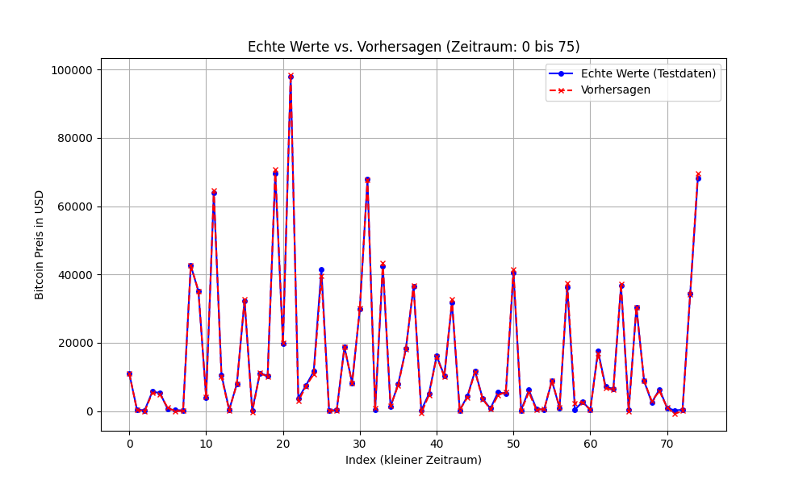

# Finanzprognose mit Deep Learning

Dieses Projekt widmet sich der Entwicklung eines Modells zur Vorhersage von Finanzdaten, insbesondere zur Analyse und Prognose der Bitcoin-Preisbewegungen. Mithilfe moderner Technologien des maschinellen Lernens, insbesondere Long Short-Term Memory (LSTM)-Netzwerken, wird versucht, präzise Vorhersagen für die zukünftige Preisentwicklung zu treffen. 

Das Ziel dieses Projekts ist es, historische Bitcoin-Preisdaten zu analysieren und ein Modell zu entwickeln, das zukünftige Preisbewegungen vorhersagen kann.

# Verwendete Technologien und Werkzeuge
	•	TensorFlow/Keras:
	•	Die Hauptbibliothek für den Aufbau, das Training und die Optimierung des LSTM-Modells.
	•	yFinance-Paket:
	•	Ermöglicht den Zugriff auf historische Finanzdaten, einschließlich Bitcoin-Preisen und relevanten Marktkennzahlen.
	•	Matplotlib:
	•	Zum Visualisieren der Preisbewegungen und der Modellprognosen. Dies hilft bei der Veranschaulichung von Unterschieden zwischen tatsächlichen und vorhergesagten Werten.
	•	Pandas und NumPy:
	•	Zum Laden, Bearbeiten und Vorverarbeiten der Daten, um sicherzustellen, dass sie im richtigen Format für das Modell bereitgestellt werden.

# Modellübersicht

Das Projekt verwendet ein LSTM-Modell mit einer sequentiellen Architektur. Dieses Modell umfasst:

	•	Zwei LSTM-Schichten mit Dropout-Regularisierung, um Overfitting zu reduzieren.
	•	Eine Dense-Schicht (voll verbunden), um die finale Vorhersage zu liefern.
	•	Eine MSE-Loss-Funktion zur Optimierung des Modells und Minimierung des Fehlers zwischen tatsächlichen und vorhergesagten Werten.

Zusätzlich wird ein MinMax-Scaler verwendet, um die Daten zu normalisieren. Dies ist entscheidend für die effektive Nutzung neuronaler Netze, da es hilft, numerische Instabilitäten zu vermeiden.

# Vorhersage auf Test-Daten: 

